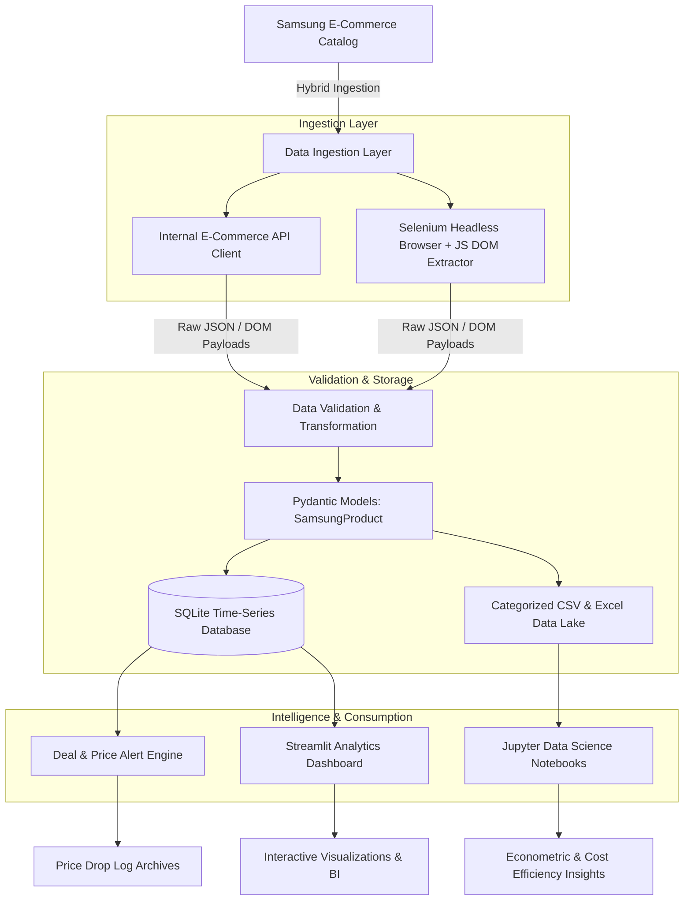

# 📺 Samsung E-Commerce Intelligence & Automated Price Tracker

[](https://www.python.org/downloads/)
[](https://www.selenium.dev/)
[](https://streamlit.io/)
[](https://plotly.com/)
[](https://www.sqlite.org/)
[](https://opensource.org/licenses/MIT)

> An end-to-end e-commerce data pipeline, competitive intelligence system, and interactive analytics suite tracking Samsung's Canadian catalog across **11 major product categories** with automated price-drop alerts, historical snapshots, and deep variant matrix unbundling.

---

## 🌟 Project Highlights & Business Value

Online electronics retail is characterized by volatile promotional pricing, complex multi-attribute product variants (e.g., storage tiers, colorways, display sizes), and heavy client-side JavaScript rendering that breaks conventional scrapers.

This project delivers a **production-ready data engineering solution** that:

* **Bypasses Dynamic Hydration & Anti-Scraping**: Uses a dual-engine ingestion pipeline combining high-throughput reverse-engineered internal e-commerce APIs with a robust Selenium headless browser fallback capable of deep DOM variant extraction.
* **Unbundles Multi-Variant Matrices**: Dissects multi-color and multi-storage cards into clean, atomic product records with unique SKUs, financing options, promotional badges, and real-time stock availability.
* **Maintains Historical Price Snapshots**: Stores longitudinal price logs in an indexed SQLite database (`samsung_tracker.db`) to monitor price movements, promotional frequency, and all-time lows (ATL).
* **Automates Deal & Price Drop Alerting**: Built-in rules engine computes threshold discounts (>20%), all-time lows, and day-over-day price drops, dispatching structured alert summaries to disk and UI.
* **Interactive Executive Dashboard**: A modern Streamlit web application providing instant catalog search, dynamic category filtering, value-for-money scatter plots, and time-series price trackers.

---

## 🏗️ Architecture Overview



---

## 📊 Catalog Coverage

The pipeline monitors all core Samsung hardware divisions:

| Category | Typical Products Tracked | Key Extracted Variant Attributes |
| :--- | :--- | :--- |
| **Smartphones** | Galaxy S25 Ultra, S25+, Z Fold6, Z Flip6, A-Series | Storage (128GB/256GB/512GB/1TB), Colors, Financing |
| **TVs** | OLED (S90C/S95D), Neo QLED 8K/4K, The Frame | Screen Sizes (43"–98"), Resolution, Audio Tech |
| **Tablets** | Galaxy Tab S10 Ultra, Tab S10+, Tab A9+ | Wi-Fi vs. 5G, Storage, Colorways |
| **Watches** | Galaxy Watch Ultra, Watch7, Classic | Case Size (40mm/44mm/47mm), LTE/Bluetooth |
| **Audio & Buds** | Galaxy Buds3 Pro, Buds3, Buds FE | Colors, Noise Cancellation, Bundles |
| **Monitors** | Odyssey OLED G9, Neo G8, ViewFinity, Smart Monitors | Curved/Flat, Refresh Rates, Panel Type |
| **Computers** | Galaxy Book4 Ultra, Book4 Pro 360 | CPU, RAM, SSD tiers |
| **Home Appliances** | Refrigerators, Laundry, Cooking Appliances | Capacity, SmartThings compatibility, Finish |

---

## 📂 Project Structure

```text
samsung-tv-web-scraping/
├── app.py                          # Modern Streamlit interactive analytics dashboard
├── requirements.txt                # Pinned production dependencies
├── run_dashboard.bat               # One-click Windows runner for Streamlit dashboard
├── run_pipeline.bat                # One-click Windows runner for ETL & alert engine
│
├── src/                            # Modular, production-grade source code
│   ├── __init__.py                 # Package marker
│   ├── models.py                   # Data schemas (SamsungProduct, PriceSnapshot)
│   ├── scraper.py                  # Selenium WebDriver & in-browser variant extractor
│   ├── api_client.py               # Reverse-engineered API client with retry backoff
│   ├── db.py                       # SQLite database manager (snapshots, schema, indexing)
│   ├── alerts.py                   # Price-drop, all-time-low & steep-discount engine
│   └── pipeline.py                 # Unified CLI orchestrator (ETL, alerts, seeding)
│
├── data/                           # Relational time-series persistence
│   └── samsung_tracker.db          # SQLite database with product snapshots
│
├── alerts/                         # Automated alert logs
│   ├── price_alerts_2026-09-08.txt # Archived price drop alerts
│   └── price_alerts_2026-09-09.txt # Latest price drop alerts
│
├── scraped_data/                   # Category-partitioned CSV dataset repository
│   ├── Smartphones/                # Galaxy smartphone catalog data
│   ├── Tablets/                    # Galaxy tablet catalog data
│   ├── TVs/                        # Television catalog data
│   ├── Watches/                    # Smartwatch catalog data
│   ├── Monitors/                   # Computer monitor catalog data
│   └── ...                         # (Audio, Refrigerators, Cooking, Laundry, Computers)
│
├── Scraping_All_Samsung_Products.ipynb # Comprehensive multi-category EDA & Plotly notebook
├── Scraping_Samsung_Website_for_TVs.ipynb  # TV-focused extraction & econometric analysis
├── Samsung_TV_Scrapped_Data.csv    # Consolidated TV dataset (CSV)
└── Samsung_TV_Scrapped_Data.xlsx   # Consolidated TV dataset (Excel format)
```

---

## 🚀 Quick Start Guide

### 1. Prerequisites
* **Python 3.10+**
* **Google Chrome** (for Selenium browser automation)

### 2. Installation
Clone the repository and install the dependencies:
```bash
git clone https://github.com/your-username/samsung-tv-web-scraping.git
cd samsung-tv-web-scraping
pip install -r requirements.txt
```

### 3. Launch the Interactive Dashboard
Launch the Streamlit intelligence dashboard with one click:
```bash
# Windows shortcut
run_dashboard.bat

# Or via terminal command:
streamlit run app.py
```
*Open [http://localhost:8501](http://localhost:8501) in your browser.*

### 4. Run the Pipeline & Alert Engine
Execute the tracking and deal-detection pipeline:
```bash
# Windows shortcut
run_pipeline.bat

# Or via Python CLI:
# Seed database from existing CSV datasets
python -m src.pipeline --seed

# Run price drop & deal alert evaluation
python -m src.pipeline --alerts

# Simulate a test price drop on a SKU to test alerts
python -m src.pipeline --simulate-drop QN55S90CAFXZC
```

---

## 📈 Dashboard & Analytical Capabilities

The included Streamlit dashboard provides executive-level decision support:

1. **Live Key Performance Indicators**:
   * Total Active Catalog SKUs tracked.
   * Average Market Price across categories.
   * Active Deals (<span style="color:#00e676">**Discounts Detected**</span>).
   * Average Customer Rating & Review counts.
2. **Interactive Scatter & Value-for-Money Modeling**:
   * Analyzes cost efficiency (e.g., **Cost per Display Inch** on TVs and Monitors vs. Total Price).
   * Identifies sweet-spot flagship models offering premium specs at competitive price points.
3. **Historical Price Movement Charts**:
   * Visualizes longitudinal price trajectories per SKU using interactive Plotly curves.
4. **Instant Search & High-Discount Filtering**:
   * Quick filter by discount depth (>15%, >25%), keyword search (e.g. `OLED`, `S25`), or category.
5. **Data Export**:
   * One-click direct export to CSV and Excel for external reporting.

---

## 🔬 Data Extraction Schema

Every extracted product record adheres to the following typed schema:

| Column | Type | Description |
| :--- | :--- | :--- |
| `Model Name` | `string` | Full marketing name of the device / variant |
| `Color` | `string` | Extracted colorway name (e.g., Titanium Gray, Phantom Black) |
| `Storage` | `string` | Storage tier or screen dimension (e.g., 256GB, 65") |
| `SKU Code` | `string` | Unique manufacturer identification code |
| `Product Price` | `string` | Formatted promotional retail price (e.g., `$1,899.99`) |
| `Original Price` | `string` | Formatted MSRP / original price (e.g., `$2,399.99`) |
| `current_price` | `float` | Normalized numerical price for calculation |
| `original_price`| `float` | Normalized numerical original price |
| `Financing Option` | `string` | Monthly installment financing terms (e.g., `$52.78/mo`) |
| `Badge` | `string` | Promotional badge (e.g., "Save $500", "New", "Pre-order") |
| `Offers` | `string` | Bundled promotions, trade-in bonuses, or gift cards |
| `Product Rating` | `float` | Average customer review score (1.0 – 5.0) |
| `Number of Ratings` | `int` | Total count of verified customer reviews |
| `Stock Status` | `string` | Real-time inventory status (`In Stock`, `Out of Stock`) |
| `Product URL` | `string` | Direct link to the product checkout/landing page |

---

## 💡 Key Technical Innovations

* **DOM Resiliency**: Uses multi-fallback CSS selector hierarchies and custom JavaScript query execution inside the browser context, eliminating flaky Selenium element lookups.
* **Anti-Bot & Header Emulation**: Dynamically injects randomized desktop user-agents, disengages `navigator.webdriver` flags, and handles regional cookie banners automatically.
* **Graceful Degradation**: If network latency or API changes disrupt direct endpoint parsing, the pipeline automatically falls back to headless DOM crawling without losing execution state.
* **SQLite ACID Transactions**: Employs WAL (Write-Ahead Logging) mode and batch snapshot insertions to ensure database consistency even during multi-threaded batch jobs.

---

## 📜 License
This project is licensed under the MIT License - see the LICENSE file for details. 
*Disclaimer: This repository is intended strictly for educational and portfolio demonstration purposes. All product names, logos, and brands are property of their respective owners.*
